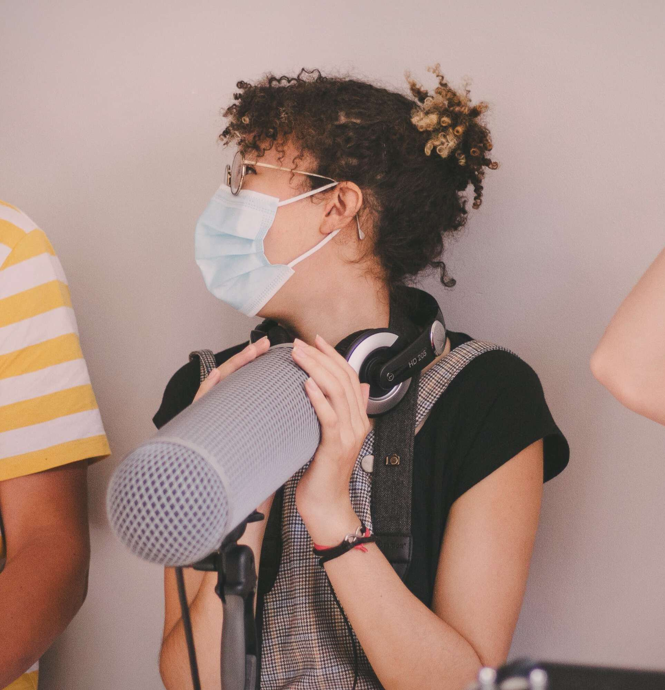

# R-Type

### Epitech's third year project, clone of [R-Type](https://en.wikipedia.org/wiki/R-Type) with multiplayer feature.

## Project Stack

<a href="https://isocpp.org/" target="_blank" rel="noreferrer"> 
        
</a>
<a href="https://www.sfml-dev.org/index.php" target="_blank" rel="noreferrer"> 
        
</a>

## Supported Platforms

<a href="https://www.sfml-dev.org/index.php" target="_blank" rel="noreferrer"> 
        
</a>
<a href="https://www.sfml-dev.org/index.php" target="_blank" rel="noreferrer">
        
</a>

## Setup Project

#### Don't forget to install correctly needed dependencies for Conan to compile correclty.

<br />

```bash
mkdir build
```

### Then

```bash
./configure.sh
```

### Or

```bash
python3 -m pip install -r requirements.txt
```
```bash
cmake . -B build -D CMAKE_BUILD_TYPE=Debug
```
```bash
make -C build -j{number_of_threads}
```

# Preview of our game

#### Little preview of our Project
#### Coming soon

# Documentations

## Network RFC

####  [Click to open the network doc](https://github.com/Chep0x61/R-Type/blob/main/doc/network_rfc.pdf)

## Project Documentation

####  [Click to open the project doc](https://github.com/Chep0x61/R-Type/blob/main/doc/refman.pdf)

# Our Team

### Developers

| [<br><sub>Flokamps</sub>](https://github.com/flokamps) | [<br><sub>Alexandre Coyras</sub>](https://github.com/AlexandreCoyras) | [<br><sub>Naikyz</sub>](https://github.com/Naikyz) | [<br><sub>Loïs Aibout</sub>](https://github.com/Lolo-Mytsu)  | [<br><sub>Chep0x61</sub>](https://github.com/Chep0x61)
| :---: | :---: | :---: | :---: | :---:

### Content Creators

| [<br><sub>Philippe Racon</sub>](https://soundcloud.com/user-736943015) | [<br><sub>Alizée Charleville</sub>](https://linktr.ee/Charleville)
| :---: | :---:

#### :heart: Special thanks to Philippe Racon "Fyra" & Alizée Charleville for their awesome skills in music and sound effects. You can find them on their link just above. :heart:

#### We hope this ReadMe was useful ! :heart:
